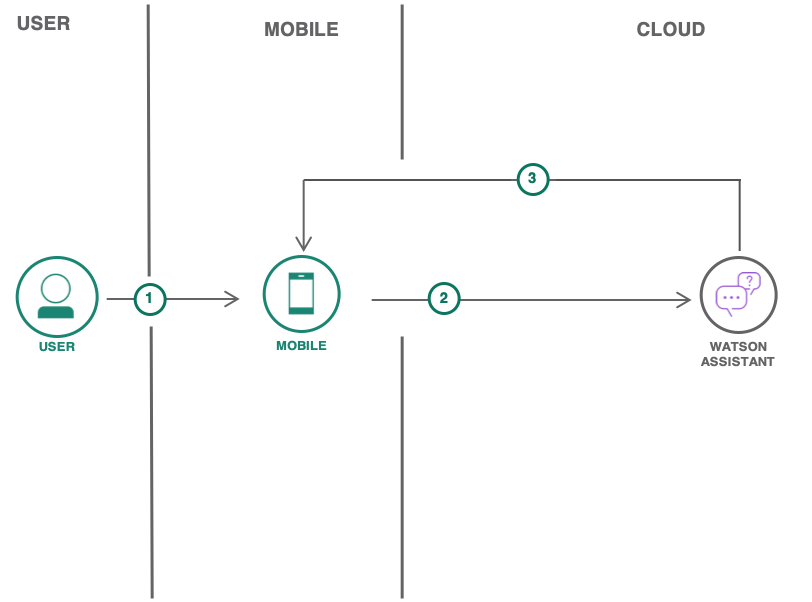

# A voice-enabled Android ChatBot powered by IBM Watson

Learn how to build an IBM Watson powered ChatBot running on Android.

It uses the following services on IBM Cloud (an open standard cloud platform for building, running, and managing applications and services)
- Watson Assistant (formerly-conversation)
- Text-to-Speech
- Speech-to-Text

For **step-by-step instructions**, refer to [Build a voice-enabled Android chatbot](https://cloud.ibm.com/docs/tutorials?topic=solution-tutorials-android-watson-chatbot)

The tutorial walks you through the process of 
- defining intents/entities
- building a dialog flow for your chatbot to respond to customer queries

You will also learn how to enable Text-to-Speech & Speech-to-Text services for easy interaction on Android.

## Solution Tutorials 
For other solution tutorials, [click here](http://ibm.biz/solution-tutorials).

## License
See [License.txt](https://github.com/IBM-Cloud/chatbot-watson-android/blob/master/License.txt) for license information.
